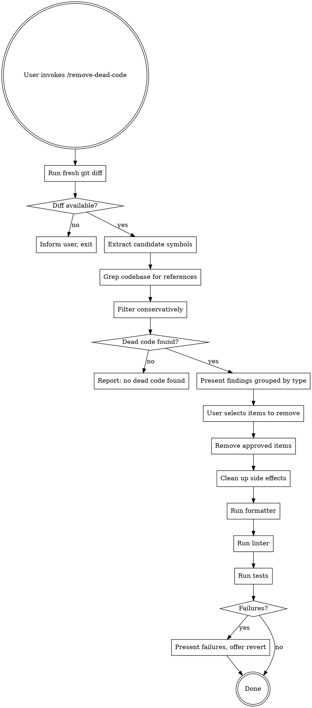

# Remove Dead Code

Find and interactively remove dead code introduced or exposed by changes on the current branch.

## Overview

Analyze the git diff between the current branch and its merge base to find clearly dead code: unused imports, unused functions/methods, unused variables, unreferenced exports, unreachable code after return/throw, and commented-out code. Present findings interactively and remove only what the user approves.

**Core principle:** Conservative. If there's any ambiguity about whether code is dead, skip it.

## Process Flow



## Step 1: Get a Fresh Diff

Always run the diff fresh. Never reuse a diff from earlier in the conversation or from any cached source.

```bash
# Find the merge base
git merge-base HEAD main || git merge-base HEAD master

# Get changed files
git diff <merge-base>...HEAD --name-only

# Get the full diff
git diff <merge-base>...HEAD
```

If there is no merge base (e.g., on the default branch with no divergent commits), inform the user and stop.

Skip binary files and files in generated directories: `node_modules`, `dist`, `build`, `.git`, `vendor`, `__pycache__`, `.next`, `coverage`, `target`.

## Step 2: Extract Candidate Symbols

Read each changed file in full. From the diff, identify:

| Type | What to look for |
|------|-----------------|
| Unused imports | `import` statements where the imported symbol never appears elsewhere in the file |
| Unused functions | Function/method declarations with 0 call sites in the entire codebase |
| Unused variables | Variables assigned but never read |
| Unreferenced exports | Exported symbols not imported anywhere in the codebase |
| Dead branches | Code after unconditional `return`, `throw`, `break`, `continue`, `sys.exit()` |
| Commented-out code | Blocks of commented code (not comment documentation) |

## Step 3: Search for References

For each candidate symbol, grep the **entire codebase** (not just changed files) for references.

A symbol is dead only if it appears **nowhere** outside its own definition. Use word-boundary matching to avoid false positives from substring matches.

```bash
# Example: check if "formatDate" is referenced anywhere
grep -rn '\bformatDate\b' --include='*.ts' --include='*.js' . | grep -v 'node_modules'
```

## Step 4: Filter Conservatively

**Skip (do not flag) anything that:**
- Has potential dynamic references (`getattr`, bracket notation like `obj[varName]`, `eval`, `importlib`, `require()` with variable argument, reflection APIs)
- Is a known framework lifecycle hook or convention (`main`, `setUp`, `tearDown`, `componentDidMount`, `__init__`, `__all__`, decorators like `@app.route`, `@pytest.fixture`, `@click.command`)
- Is in a test file that mirrors a source file (test utilities, fixtures)
- Is exported from a package entry point (`index.ts`, `__init__.py`, `mod.rs`)
- Has a comment indicating intentional retention (`// TODO`, `// used by`, `// public API`, `# noqa`)
- Is a type definition, interface, or type alias (these may be used only at compile time)

**When in doubt, skip it.** A false negative (leaving dead code) is harmless. A false positive (removing live code) is a bug.

## Step 5: Present Findings

Group by type. Include file:line and the reason it's flagged.

```
## Dead Code Found (N items)

### Unused Imports (X)
- `src/utils.py:3` — `import os` (0 references in file)

### Unused Functions (X)
- `src/helpers.js:45` — `function formatDate()` (defined but never called)

### Commented-Out Code (X)
- `src/api.ts:120-135` — 15 lines of commented code

Remove all? [Y]es / [N]o / [S]elect individually
```

Wait for user input. Do not proceed without explicit approval.

## Step 6: Remove and Clean Up

For each approved item:
1. Remove the dead code using targeted edits
2. Clean up side effects:
   - Remove orphaned blank lines left by the removal
   - If an import removal leaves an empty import block, remove the block
   - If a function removal leaves it still listed in `__all__` or an export block, remove that reference too
   - Clean up one level deep only — do not chase transitive effects

## Step 7: Run Post-Removal Checks

After all removals, run the project's toolchain in order:

1. **Formatter** — detect and run the project's formatter (prettier, black, gofmt, rustfmt, etc.)
2. **Linter** — run the project's linter (eslint, ruff, pylint, clippy, etc.)
3. **Tests** — run the test suite, or the subset relevant to changed files if the runner supports it

Detect these tools by checking for config files (`package.json` scripts, `pyproject.toml`, `Makefile`, `.eslintrc`, `prettier.config`, etc.).

**If any step fails:**
- Present the failure output to the user
- Identify which removal likely caused the failure
- Offer to revert that specific removal

## Common Mistakes

| Mistake | Fix |
|---------|-----|
| Reusing a stale diff from earlier in the conversation | Always run `git diff` fresh at invocation time |
| Removing symbols used via dynamic dispatch | Check for bracket notation, `getattr`, reflection before flagging |
| Flagging framework hooks as unused | Maintain awareness of common framework patterns |
| Removing type-only imports | Skip type definitions, interfaces, type aliases |
| Removing code then not running tests | Always run formatter, linter, and tests after removal |
| Bulk-removing without user confirmation | Always present findings and wait for approval |
